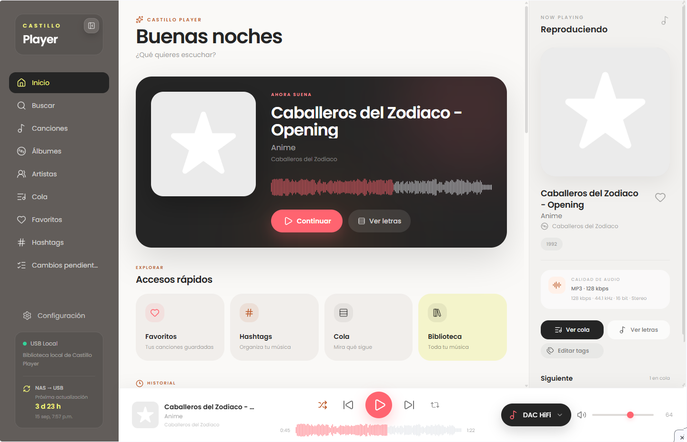
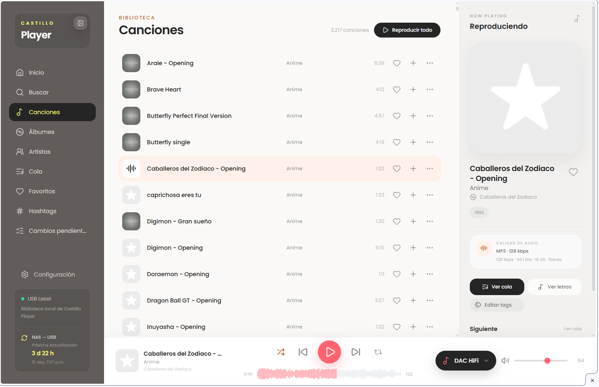
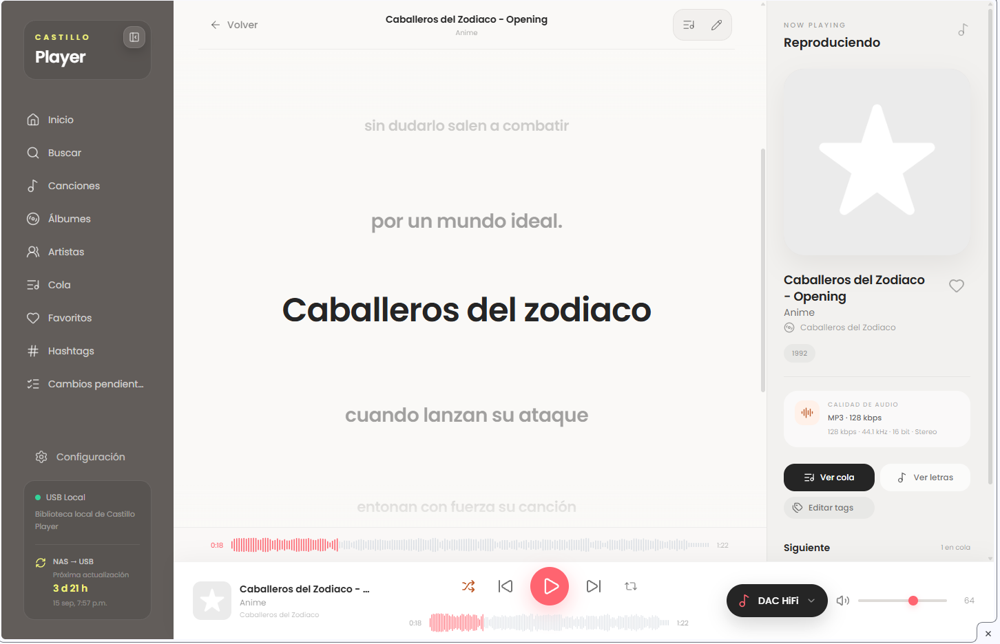
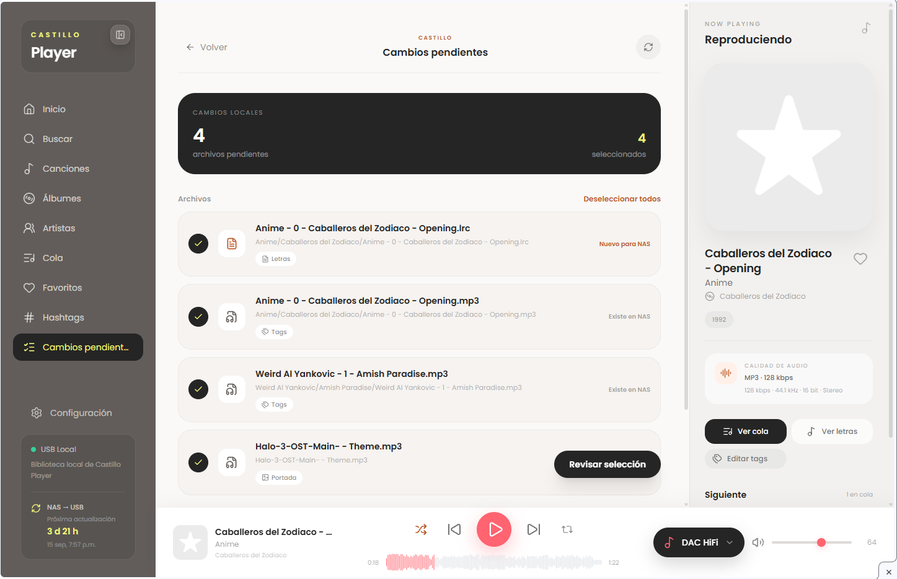

# Castillo Player

Castillo Player is an alternative modern Web UI for moOde Audio.

It runs alongside the original moOde interface and uses the existing
moOde/MPD audio stack instead of replacing it.

The project provides a responsive desktop/mobile music player with
library browsing, playlists, favorites, search, synchronized lyrics,
metadata editing, artwork editing, playback history, waveform support,
audio-output switching, hashtags, and an optional NAS synchronization
module.

> Castillo Player is an independent community project and is not an
> official moOde Audio component.


## Current status

Current development release:

```text
Castillo Player 0.1.0
```

Tested environment:

```text
moOde Audio 10.3.3
Debian GNU/Linux 13 (Trixie)
aarch64
MPD 0.24.x
PHP 8.4
Node.js 20
```

Compatibility policy:

- moOde `10.3.3` is the currently tested version.
- Other `10.3.x` releases are allowed when the required moOde
  interfaces are present, but the installer displays a warning.
- Other moOde versions are currently considered unvalidated.
- The installer also performs structural compatibility checks before
  installing Castillo Player.


## Design

Castillo Player does not replace the moOde audio engine.

It uses:

- MPD for playback and library access.
- moOde's existing audio configuration.
- the existing moOde Web/PHP environment where appropriate.
- its own Vue frontend.
- its own PHP API.
- small privileged helper programs with restricted sudo rules.

By default Castillo Player is installed side-by-side with moOde:

```text
moOde:
http://<player>/

Castillo Player:
http://<player>/castillo/
```

The core installer does not change the moOde root URL.


## Main features

Castillo Player currently includes:

- Responsive desktop and mobile interface.
- Artists, albums and songs browsing.
- Full-library playback.
- Queue management.
- Playlists.
- Favorites.
- Global search.
- Current-track indication in music lists.
- Real-time playback state through Server-Sent Events.
- Local elapsed-time/progress updates without constant polling.
- Synced LRC lyrics.
- Click/tap lyrics seeking.
- Lyrics editor.
- Audio tag editor.
- Embedded artwork editor.
- Embedded artwork priority with folder-art fallback.
- Playback history.
- Waveform generation.
- Hashtag indexing and browsing.
- Local DAC / Bluetooth audio-output selector.
- Preservation of playback position when changing audio output.
- moOde settings integration.
- PWA support.
- Optional NAS synchronization.


## Repository layout

```text
castillo-player/
├── frontend/
├── api/
├── backend/
│   └── waveform.py
├── helpers/
├── config/
│   ├── castillo.ini.example
│   └── sudoers-core.template
├── optional/
│   └── nas-sync/
│       ├── castillo-pending-change
│       ├── castillo-pending-check
│       ├── castillo-pending-sync
│       ├── nas-music-sync
│       ├── install-nas-sync.sh
│       ├── sudoers/
│       └── systemd/
├── docs/
├── install.sh
├── uninstall.sh
└── README.md
```


## Core installation

Clone or copy the Castillo Player repository onto the moOde system and
enter the repository directory.

Before installing, run the validation mode:

```bash
sudo ./install.sh --check
```

This checks:

- repository structure;
- required moOde interfaces;
- detected moOde version;
- required system commands;
- Castillo Player dependencies;
- PHP syntax;
- Python syntax;
- Bash syntax;
- sudoers syntax.

`--check` does not install files or modify the system.


### Existing Castillo configuration

If this file already exists:

```text
/etc/castillo-player/castillo.ini
```

the installer preserves it.


### New installation

For a new installation, specify the physical music-library directory
and the corresponding MPD path.

Example:

```bash
sudo ./install.sh \
  --library-root "/media/MUSIC_DRIVE/Music" \
  --mpd-prefix "USB/MUSIC_DRIVE/Music/"
```

The physical library path must already exist.

The MPD prefix must correspond to the same directory as
`library_root` and must end with `/`.


### Normal installation

If a valid Castillo configuration already exists:

```bash
sudo ./install.sh
```

The installer:

- preserves existing Castillo configuration;
- preserves Castillo runtime data;
- builds the frontend in an isolated temporary directory;
- installs the core backend;
- installs the core helpers;
- installs restricted sudo rules;
- installs the PHP API;
- deploys the production frontend;
- preserves an existing hashtag index;
- builds the initial hashtag index if one does not exist;
- validates nginx and MPD after installation.


## Installed paths

Core frontend:

```text
/var/www/castillo
```

PHP API:

```text
/var/www/castillo-api
```

Backend:

```text
/opt/castillo-player/backend
```

Configuration:

```text
/etc/castillo-player/castillo.ini
```

Runtime data:

```text
/var/lib/castillo-player
```

Core helpers:

```text
/usr/local/sbin/castillo-audio-output
/usr/local/sbin/castillo-cover-save
/usr/local/sbin/castillo-hashtags-index
/usr/local/sbin/castillo-lrc-save
/usr/local/sbin/castillo-tags-save
```

Core sudo policy:

```text
/etc/sudoers.d/castillo-player
```


## Configuration

The public configuration template is:

```text
config/castillo.ini.example
```

Example:

```ini
[core]
install_dir = "/opt/castillo-player"

; Physical path to the local music library.
library_root = "/media/MUSIC_DRIVE/Music"

; MPD path corresponding to library_root.
; It must end with "/".
library_mpd_prefix = "USB/MUSIC_DRIVE/Music/"

state_dir = "/var/lib/castillo-player"
helper_dir = "/usr/local/sbin"


[mpd]
host = "127.0.0.1"
port = 6600


[moode]
www_root = "/var/www"
btaudio_script = "/var/www/util/set-btaudio.php"
db_path = "/var/local/www/db/moode-sqlite3.db"


[nas]
; Optional NAS synchronization module.
; Leave false if NAS synchronization is not used.
enabled = false

source_name = "YOUR_NAS_SOURCE"
readonly_root = "/mnt/NAS/Music"
readwrite_root = "/mnt/NAS/Music_RW"
```

Do not publish personal paths, hostnames, network addresses, NAS
credentials or other site-specific information in the repository.


## Runtime data

Runtime files are stored outside the repository:

```text
/var/lib/castillo-player
```

Typical runtime data includes:

```text
hashtags.sqlite
history.json
library-cache.json
pending-changes.json
state.json
waveforms/
```

These files are intentionally not committed to Git.


# Optional NAS synchronization

The NAS synchronization module is optional.

The core player works with:

```ini
[nas]
enabled = false
```

without requiring any NAS helpers or services.


## NAS design

The NAS module provides two different synchronization directions.


### NAS to local library

The NAS is treated as the content source.

Synchronization is performed with `rsync`.

Pending local edits are automatically excluded so that unsynchronized
metadata, artwork or lyrics changes are not overwritten.


### Local changes to NAS

Edits made in Castillo Player can be registered as pending changes.

Supported pending-change types include:

- metadata/tags;
- artwork;
- lyrics.

Before local changes are copied to the NAS, Castillo checks the stored
NAS baseline to detect conflicts.

Changes to the same physical audio file are grouped together.


## Install the optional NAS module

The Castillo Player core must be installed first.

Validate the NAS module:

```bash
sudo optional/nas-sync/install-nas-sync.sh --check
```

Then install it:

```bash
sudo optional/nas-sync/install-nas-sync.sh
```

If the preserved Castillo configuration already contains valid NAS
settings, they are reused automatically.

Alternatively, values can be supplied explicitly:

```bash
sudo optional/nas-sync/install-nas-sync.sh \
  --source-name "MusicNAS" \
  --readonly-root "/mnt/NAS/MusicNAS" \
  --readwrite-root "/mnt/NAS/MusicNAS_RW"
```

The read-only NAS path must already exist and be mounted.

The installer installs and enables the systemd timer, but it does not
start a NAS synchronization automatically.


## NAS dry-run

Always test NAS-to-local synchronization before starting the timer:

```bash
sudo /usr/local/sbin/nas-music-sync \
  --force \
  --dry-run
```

A safe dry-run with an already synchronized library should end with
output similar to:

```text
Number of created files: 0
Number of deleted files: 0
Number of regular files transferred: 0

DRY RUN completed successfully.
No files were modified.
The last synchronization time was not updated.
```

Depending on the actual differences between the NAS and local library,
a valid dry-run may report files that would be created, updated or
deleted.

Review the result before enabling automatic synchronization.

If the result is correct, start the timer:

```bash
sudo systemctl start nas-music-sync.timer
```

Check its status:

```bash
systemctl is-enabled nas-music-sync.timer
systemctl is-active nas-music-sync.timer
systemctl list-timers nas-music-sync.timer --no-pager
```


## NAS safety

The synchronization implementation includes:

- one-way NAS-to-local mirroring;
- protection for pending local edits;
- conflict detection before local-to-NAS synchronization;
- synchronization locking;
- free-space protection;
- dry-run support;
- preservation of pending state;
- preservation of the last-success state during dry-runs.

The NAS module must never be configured with credentials committed to
the repository.


## Pending local changes

When supported edits are made locally, Castillo Player can register
them for later synchronization to the NAS.

Changes affecting the same physical audio file are grouped together.

For example, metadata and embedded artwork modifications to the same
audio file are represented as one pending file with multiple change
types.

Lyrics are stored as separate `.lrc` files and therefore appear as
separate pending items.


## NAS conflict detection

When a local change is first registered, Castillo stores a baseline
representing the NAS file at that moment.

Before sending the local file back to the NAS, Castillo compares the
current NAS state with the saved baseline.

A pending item can therefore be reported as:

```text
ready
conflict
blocked
error
```

Only safe items should be synchronized.


# Uninstallation

The default uninstaller removes Castillo Player while preserving its
configuration and runtime data.

Preview the uninstall plan:

```bash
sudo ./uninstall.sh --check
```

Normal uninstall:

```bash
sudo ./uninstall.sh
```

By default it:

- stops the optional NAS synchronization;
- disables/removes Castillo NAS systemd units;
- removes Castillo sudo rules;
- removes Castillo helpers;
- removes the frontend;
- removes the API;
- removes the backend;
- preserves `/etc/castillo-player`;
- preserves `/var/lib/castillo-player`;
- preserves `/var/lib/nas-music-sync`;
- sets `nas.enabled = false` in preserved configuration;
- preserves the NAS source name and paths;
- removes the known Castillo root redirect if one exists;
- validates nginx afterward.

The uninstall operation does not delete the music library.


## Purge configuration

To also remove the Castillo configuration:

```bash
sudo ./uninstall.sh --purge-config
```


## Purge runtime data

To also remove Castillo runtime data:

```bash
sudo ./uninstall.sh --purge-data
```


## Full purge

To remove configuration and runtime data:

```bash
sudo ./uninstall.sh --purge-all
```

Use purge options carefully.

They are intentionally separate from the normal uninstall operation.


# Reinstallation

A normal uninstall preserves configuration and runtime state.

This allows Castillo Player to be reinstalled later using:

```bash
sudo ./install.sh --check
sudo ./install.sh
```

If the NAS module was previously configured, its source name and paths
remain stored in the preserved configuration while `nas.enabled`
remains `false`.

The optional NAS module can then be reinstalled with:

```bash
sudo optional/nas-sync/install-nas-sync.sh --check
sudo optional/nas-sync/install-nas-sync.sh
```

The NAS installer reuses the preserved settings and enables the module
again.


# Updating Castillo Player

For an update, replace or update the repository and run:

```bash
sudo ./install.sh --check
sudo ./install.sh
```

Existing configuration and runtime data are preserved.

If the optional NAS module is used:

```bash
sudo optional/nas-sync/install-nas-sync.sh --check
sudo optional/nas-sync/install-nas-sync.sh
```


# Compatibility

Castillo Player currently uses moOde's existing:

- nginx environment;
- PHP environment;
- MPD installation;
- Bluetooth/audio-output support;
- selected internal PHP interfaces.

The installer checks for these interfaces before modifying the system.


## moOde version detection

Castillo Player uses:

```bash
moodeutl -s
```

to detect the installed moOde release when possible.

Current compatibility policy:

```text
moOde 10.3.3     tested
moOde 10.3.x     compatible-series warning
Other versions   unvalidated warning
Unknown version  warning
```

A version warning does not override missing required interfaces.

Installation stops when required moOde components are absent.


## Tested platform

The initial development and validation environment is:

```text
moOde Audio 10.3.3
Debian GNU/Linux 13 (Trixie)
Linux aarch64
MPD 0.24.13
PHP 8.4
Python 3.13
Node.js 20
nginx 1.26
```

This list describes the tested environment and should not be
interpreted as a strict dependency on every exact package version.


# Development

Frontend stack:

```text
Vue 3
Vite
Tailwind CSS
Lucide icons
```

The frontend source is under:

```text
frontend/
```

For development or manual build validation:

```bash
cd frontend
npm ci
npm run build
```

The public installer performs its own isolated production build and
does not require a prebuilt `frontend/dist` directory.


## Frontend deployment

The production build is deployed to:

```text
/var/www/castillo
```

The repository does not publish the development-only deployment script
used by the original development system.


## API

The Castillo Player PHP API is under:

```text
api/
```

It provides access to functionality including:

- playback state;
- library data;
- queue control;
- playlists;
- favorites;
- lyrics;
- metadata;
- artwork;
- hashtags;
- playback history;
- audio-output switching;
- waveform generation;
- optional NAS/pending-change operations.


## Real-time playback state

Castillo Player uses Server-Sent Events for real-time MPD state
updates.

The frontend maintains its own lightweight local elapsed-time clock for
smooth progress display instead of repeatedly polling the API.


## Lyrics

Castillo Player supports synchronized `.lrc` lyrics stored alongside
audio files.

Supported behavior includes:

- synchronized display;
- timestamp seeking;
- click/tap seeking;
- LRC offset support;
- credits separated from timed lines;
- multiline text import;
- manual timestamp editing.


## Metadata and artwork

Castillo Player can edit common audio metadata fields, including:

```text
Title
Artist
Album
Album Artist
Year
Track
Genre
```

Artwork edited through Castillo Player is embedded into the audio file.

Artwork display priority is:

```text
1. Embedded artwork
2. Folder artwork
```

Common folder-art names are used as fallback when embedded artwork is
not available.


## Hashtags

Castillo Player maintains a reconstructible hashtag index using:

```text
/var/lib/castillo-player/hashtags.sqlite
```

The index is runtime data and is not stored in Git.

If the index does not exist during installation, the core installer
attempts to build it automatically.


## Waveforms

Waveform data is generated by the backend waveform helper and cached
under:

```text
/var/lib/castillo-player/waveforms
```

Generated waveform data is runtime content and is not committed to the
repository.


## Privileged helpers

Operations that require elevated permissions are implemented as small,
dedicated helpers.

Core helpers are published under:

```text
helpers/
```

Installed helpers are placed under:

```text
/usr/local/sbin
```

The Web server does not require unrestricted passwordless sudo.

Castillo Player installs explicit least-privilege sudo rules for only
the helper commands required by the project.


# Security and privacy

Castillo Player is designed so that public source files do not require
private environment information.

Before publishing configuration files or diagnostic output, remove:

- usernames;
- hostnames;
- IP addresses;
- MAC addresses;
- Wi-Fi information;
- NAS server addresses;
- NAS share paths that identify a private environment;
- NAS usernames/passwords;
- local media paths when they identify a private environment.

The public repository must never contain NAS credentials.


## Configuration privacy

The real configuration file is:

```text
/etc/castillo-player/castillo.ini
```

It is not part of the repository.

The repository contains only the neutral example:

```text
config/castillo.ini.example
```


## Runtime privacy

Runtime databases and state files are not intended for Git.

Examples include:

```text
history.json
library-cache.json
pending-changes.json
state.json
hashtags.sqlite
waveforms/
```

These paths are excluded through `.gitignore`.


## Sudo security

Castillo Player must not depend on a global rule such as:

```text
www-data ALL=(ALL) NOPASSWD: ALL
```

Instead, the project installs explicit rules granting access only to
the dedicated Castillo helper commands required by the Web API.


# Project philosophy

Castillo Player is intended to complement moOde rather than fork or
replace its audio stack.

The project goals are:

- modern responsive UI;
- minimal changes to the underlying moOde system;
- reversible installation;
- preservation of user data;
- side-by-side operation with the original moOde interface;
- optional advanced features kept separate from the core player;
- explicit compatibility checks;
- safe update and uninstall behavior;
- least-privilege helper execution;
- separation between public source code and private configuration.


# Release notes

The first planned public release is:

```text
v0.1.0
```

The initial release is intended as a community project for users who
want an alternative Web UI on top of moOde Audio.


## v0.1.0 goals

The initial public release includes:

- core Castillo Player Web UI;
- responsive desktop/mobile player;
- library browsing;
- playlists;
- favorites;
- search;
- queue management;
- synchronized lyrics;
- lyrics editor;
- metadata editor;
- artwork editor;
- hashtags;
- playback history;
- waveform support;
- audio-output switching;
- PWA support;
- automatic core installer;
- optional NAS synchronization installer;
- reversible uninstaller;
- moOde compatibility detection.


# Acknowledgements

Castillo Player is designed to run on top of moOde Audio and MPD.

moOde Audio remains responsible for the underlying audio system,
hardware configuration, playback services and many of the system
components used by Castillo Player.

Castillo Player is an independent community project and is not
affiliated with or officially supported by the moOde Audio project.

# Screenshots

## Desktop

### Now Playing



### Music Library



### Synchronized Lyrics




## Mobile

| Now Playing | Synchronized Lyrics |
| --- | --- |
|  |  |


## Optional NAS synchronization

The optional NAS synchronization module tracks local metadata, artwork
and lyrics changes before they are synchronized back to the NAS.



# License

Castillo Player is distributed under the GNU General Public License
Version 3 only (`GPL-3.0-only`).

See `LICENSE` and `NOTICE.md` for license and attribution information.

Castillo Player is an independent community project. moOde Audio and
other third-party components remain subject to their own copyright and
license terms.
